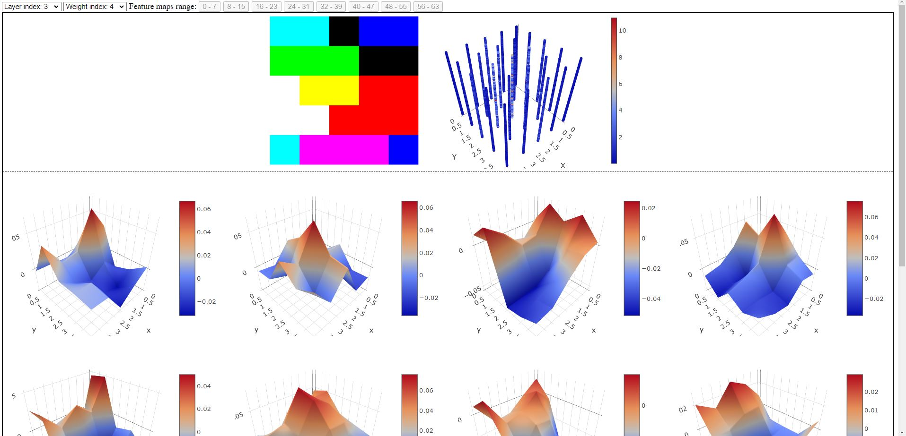

# Filter visualizer :toolbox:
The filter visualizer offers a powerful tool for observing and debugging neural network weights. The 2D representation is available for each neuron in the chosen convolutional neural network layer and you can explore both the Fourier transform and the 3D representation of each neuron channel. This work was developed during my master thesis; please use it responsibly and ensure it fits your needs. A tutorial on how to use this application is shown on the `tutorial.ipynb` file. 

## How to run it
Execute the `filter_visualizer.py` file, for example, with `python filter_visualizer.py`. After starting the application, launch your web browser and navigate to the default address: [http://127.0.0.1:5000/](http://127.0.0.1:5000/).

## Requirements
This work has been mainly developed with PyTorch and Flask. The current artificial neural network used in the filter visualizer is AlexNet, pretrained on the ImageNet dataset. Future updates will introduce the flexibility to select different neural networks. However, for now, you can switch the neural network by modifying the `filter_visualizer.py` file.

## Features
The application offers the following features:
* Layer dropdown to select the convolutional layer of the chosen neural network.
* Weight dropdown for choosing specific neurons within a layer.
* Feature map range buttons that allow the visualization of specific channels within a neuron.
* 2D neuron visualization, using PCA for neurons that exceed three channels, in order to visualize the neuron in RGB.
* Fourier space visualization for each neuron channel.
* 3D plotting of individual channels within the selected neuron.

